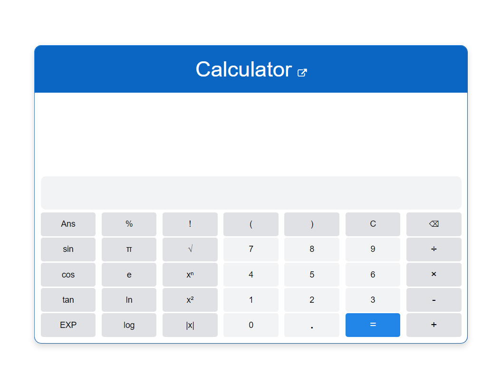

# Scientific Calculator - Online Web Application

An advanced **online** scientific calculator built using **JavaScript** and modern web technologies. This project enhances mathematical calculations by offering a dynamic, easy-to-use interface similar to physical scientific calculators.

🔗 **Live Demo:** [Scientific Calculator](https://goutamdevcalc.netlify.app/)  
<a href="https://goutamdevcalc.netlify.app/"></a>

## 🚀 Features

- **Multi-Function Expression Support** – Accepts complex mathematical expressions just like a physical calculator.
- **Smart Backspace Handling** – Clears the entire input after a completed calculation; otherwise, removes only the last character.
- **Intelligent Expression Parsing** – Automatically interprets missing parentheses and multiplication signs for seamless calculations.
- **Parentheses Validation** – Uses a **Stack Data Structure** to check for balanced brackets and displays errors accordingly.
- **Keyboard & Mouse Input** – Supports both keyboard typing and mouse clicks for convenient usage.
- **Optimized Performance** – Efficient JavaScript execution ensures fast calculations and a responsive interface.

## 🛠 Tech Stack

| Component  | Technology Used |
|------------|----------------|
| Frontend   | HTML, CSS, JavaScript |
| Backend    | Node.js (for future API integration) |
| Deployment | GitHub Pages, Vercel (planned) |
| Database   | N/A (all calculations are client-side) |

## 🔮 Upcoming Enhancements

- **Degree-Radian Toggle** – Enable switching between **degrees** and **radians** for trigonometric functions.
- **Inverse Trigonometric Functions** – Adding **sin⁻¹, cos⁻¹, tan⁻¹** for extended functionality.
- **Improved UI/UX** – Designing a **cleaner, mobile-friendly interface** for better usability.
- **User Authentication** – Allow users to save previous calculations (**Planned Future Feature**).

## 📦 Installation & Usage

This calculator runs **entirely online**—no installation is required. However, if you wish to modify or contribute, follow these steps:

```sh
# Clone the repository
git clone https://github.com/goutamdev/scientific-calculator.git

# Navigate to the project directory
cd scientific-calculator

# Open the index.html file in a browser (since it's a client-side project)
